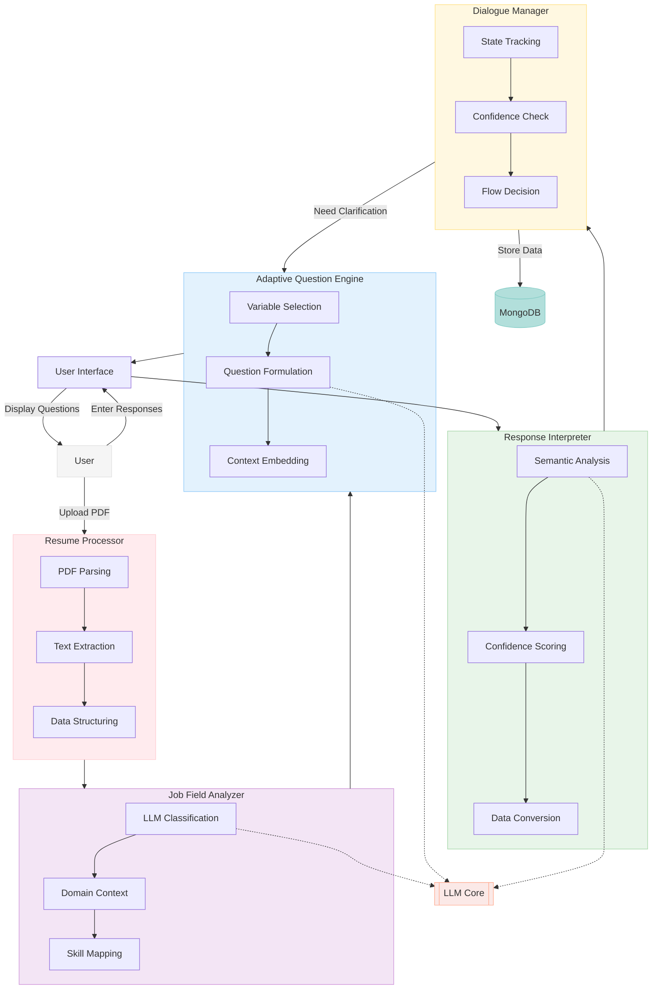

1. PDF Parser
2. Job Field Analyser Agent
3. Adaptive Questions Engine Agent
4. Response Interpreter Agent
5. Dialogue Manager
6. Database Manager

1. PDF Parser
- Extracts text from PDF files

# 2. Job Field Analyser Agent

- **Core Function**: Identifies user's industry from resume and generates quantifiable industry-specific variables for Optimal Stopping Theory calculations

- **Industry Identification Process**:
  - Extract key terms, job titles, and skills from resume
  - Match against industry keyword databases
  - Calculate confidence score for industry classification
  - Output primary industry with confidence percentage

- **Output Data**:
  - Primary industry classification (e.g., Technology, Healthcare, Finance)
  - Set of quantifiable industry-specific variables with baseline values
  - Industry-specific scoring functions for offer evaluation

- **Industry-Specific Quantifiable Variables Examples**:
  
  **Technology Industry**:
  - Remote work score (0-10): Measures alignment with desired remote/hybrid arrangement
  - Tech stack relevance (0-10): How well the company's tech aligns with career goals
  - Equity compensation value ($): Estimated annual value of stock options/RSUs
  - On-call burden score (0-10): Inverse score where 10 = no on-call, 0 = frequent on-call
  - Innovation index (0-10): Based on company's patents, research, or product launches
  - Learning opportunity factor (0-10): Resources dedicated to professional development
  
  **Healthcare Industry**:
  - Patient-to-provider ratio (numeric): Lower numbers typically preferred
  - Weekly hours flexibility score (0-10): Higher scores = more schedule control
  - Procedure variety index (0-10): Diversity of clinical experiences available
  - Continuing education allowance ($): Annual budget for additional training
  - Autonomy rating (0-10): Degree of independent decision-making permitted
  - Burnout risk factor (0-10): Inverse score where 10 = low burnout environment
  
  **Finance Industry**:
  - Annual bonus percentage (%): Expected bonus as percentage of base salary
  - Client quality score (0-10): Prestige and stability of client portfolio
  - Regulatory burden hours (numeric): Weekly hours spent on compliance
  - Performance-based compensation percentage (%): Portion of total comp tied to performance
  - Deal/transaction volume (numeric): Average monthly deals/transactions
  - Advancement timeline (months): Average time to next promotion level

- **Variable Normalization Process**:
  - Convert all variables to 0-10 scale or financial value ($) for consistent calculations
  - Apply industry-specific weighting based on user preferences
  - Generate composite score formula for offer comparison
  - Calculate expected value of each offer for OST calculations

- **Integration Points**:
  - Provides Database Manager with numerical variable definitions
  - Supplies mathematical formulas for Optimal Stopping Theory calculations
  - Defines industry-specific thresholds for "good offer" determination

# 3. Adaptive Questions Engine Agent

- **Core Function**: Generates tailored questions to gather information needed for evaluating job offers using OST

- **Question Generation Process**:
  - Receives industry classification from Job Field Analyser
  - Selects relevant question set based on identified industry
  - Customizes questions based on career level and preferences
  - Prioritizes questions to maximize information gain

- **Question Structure Example** (for Technology Industry):

```json
[
  {
    "q": "On a scale of 0-10, how important is the ability to work remotely to you?",
    "variables_involved": ["remote_work_score"]
  },
  {
    "q": "What programming languages and technologies are you most interested in working with?",
    "variables_involved": ["tech_stack_relevance"]
  },
  {
    "q": "How would you feel about being on-call outside regular work hours? (0=strongly dislike, 10=completely fine)",
    "variables_involved": ["on_call_burden_score"]
  },
  {
    "q": "When evaluating job offers, how would you rank equity compensation compared to base salary? (0=only care about salary, 10=willing to take lower salary for higher equity)",
    "variables_involved": ["equity_compensation_value"]
  },
  {
    "q": "On a scale of 0-10, how important is it for you to work at a company known for innovation?",
    "variables_involved": ["innovation_index"]
  },
  {
    "q": "How would you rate the importance of learning opportunities and professional development? (0-10)",
    "variables_involved": ["learning_opportunity_factor"]
  }
]
```

- **Question Adaptation Logic**:
  - Adjust question specificity based on user expertise level
  - Present questions in conversational format through Dialogue Manager
  - Collect numeric or normalizable responses for OST calculations

- **Integration Points**:
  - Receives industry classification from Job Field Analyser
  - Sends questions to Dialogue Manager for conversation flow
  - Updates Database Manager with user responses
  - Notifies Response Interpreter when sufficient data is collected

- **Validation Process**:
  - System automatically checks if each industry-specific variable created from Job Field Analyser Agent has at least one corresponding question it will check it manually
  - For any variables without associated questions, the system will output:
    "Missing questions for variables: [variable_names]"
  - Process repeats until all variables have 1-3 associated questions
  - Final validation ensures all questions produce quantifiable outputs usable in OST calculations

# 4. Response Interpreter Agent

- **Core Function**: Processes user responses to questions and converts them into quantifiable values for OST calculations

- **Response Processing Pipeline**:
  - Receives raw user responses from Dialogue Manager
  - Identifies question type and associated variables
  - Applies appropriate scoring methodology based on variable type
  - Assigns confidence level to each interpretation

- **Scoring Methodologies**:
  - Direct numerical inputs (salary, hours, etc.): Parse and validate ranges
  - Scale questions (0-10 ratings): Map directly to normalized values
  - Text responses: Extract sentiment and key terms, convert to numerical values
  - Multiple choice: Map selections to predefined numerical values

- **Confidence Scoring**:
  - Assigns confidence level (0-100%) to each interpretation
  - High confidence (80-100%): Direct numerical answers, clear scale responses
  - Medium confidence (50-79%): Inferred values from text with clear indicators
  - Low confidence (<50%): Ambiguous responses requiring clarification

- **Data Normalization**:
  - Standardizes values across different scales (percentage, dollar amounts, ratings)
  - Applies proper weighting based on user's stated preferences
  - Converts all values to formats compatible with OST calculations

- **Output Format**:
  ```json
  [
    {
      "raw_value": "I strongly prefer to work remotely most of the time", // Original user response text
      "variable_id": "remote_work_score", // The primary variable this response maps to
      "normalized_value": 8.5, // Converted numerical value on standardized scale (0-10)
      "confidence": 75, // How certain the system is about this interpretation (0-100%)
      "relevance": 0.9 // How directly the response relates to this variable (0-1)
    },
    {
      "raw_value": "I strongly prefer to work remotely most of the time", // Same raw input can affect multiple variables
      "variable_id": "work_life_balance_score", // Secondary variable affected by this response
      "normalized_value": 7.2, // Different score for this variable context
      "confidence": 60, // Lower confidence for this secondary interpretation
      "relevance": 0.5 // Medium relevance - response partially relates to this variable
    }
  ]
  ```

- **Integration Points**:
  - Receives raw responses from Dialogue Manager
  - Consults variable definitions from Job Field Analyser
  - Sends normalized data to Database Manager
  - Provides input data for OST calculations

# 5. Dialogue Manager

# 5. Dialogue Manager

- **Core Function**: Orchestrates the conversation flow with the user, managing question sequencing and clarification requests

- **Context Management**:
  - Maintains a context cache for each variable:
    ```javascript
    {
      "remote_work_score": {
        "contexts": [
          {
            "raw_value": "I strongly prefer to work remotely most of the time",
            "normalized_value": 8.5,
            "confidence": 75,
            "relevance": 0.9,
            "timestamp": "2025-03-16T14:32:45"
          },
          {
            "raw_value": "I need at least 3 days remote per week",
            "normalized_value": 7.2,
            "confidence": 85,
            "relevance": 0.95,
            "timestamp": "2025-03-16T14:35:12"
          }
        ],
        "current_confidence": 80, // Weighted average based on relevance and recency
        "final_value": 7.8, // Aggregated normalized value
        "status": "confirmed" // pending, clarifying, confirmed
      }
    }
    ```

- **Question Prioritization Logic**:
  - Uses confidence threshold (default: 70%) to determine adequate understanding
  - Prioritizes questions based on:
    1. Variables with no data (confidence = 0)
    2. Variables with low confidence (<50%)
    3. Variables with medium confidence (50-70%)
    4. Variables with contradicting responses
  - Considers variable interdependencies when sequencing questions

- **Clarification Mechanism**:
  - Generates follow-up questions for low confidence variables:
    ```
    "I understand you value remote work at approximately 8/10 importance. Is that accurate?"
    ```
  - Creates disambiguating questions when responses conflict:
    ```
    "Earlier you mentioned preferring fully remote work, but you also said you enjoy collaborative office environments. Could you clarify your preference?"
    ```

- **Conversation State Management**:
  - Tracks overall conversation progress (10/15 variables collected)
  - Maintains history of questions asked and responses received
  - Creates natural transitions between topic areas
  - Provides periodic summaries of gathered information

- **Response Re-evaluation**:
  - Periodically reviews all variables when new context emerges
  - Updates confidence scores and normalized values based on comprehensive view
  - Example: If user later mentions "work-life balance is my top priority," may retroactively increase confidence in remote work preference

- **Completion Detection**:
  - Determines when sufficient information has been gathered for OST calculations
  - Required variables: All critical variables above threshold confidence
  - Optional variables: Most above threshold confidence
  - Triggers transition to job offer evaluation phase

- **Integration Points**:
  - Receives questions from Adaptive Questions Engine
  - Sends user responses to Response Interpreter
  - Updates Database Manager with finalized variable values
  - Notifies user of progress and next steps

# 6. Database Manager
 - WE USE json database!
- **Core Function**: Centralizes storage and retrieval of processed data from all previous components

- **Primary Responsibilities**:
  - Stores finalized values for all variables with confidence metrics
  - Maintains user profile information extracted from resume
  - Provides persistence across conversation sessions
  - Enables data retrieval for OST calculations

- **Data Structure**:
  ```javascript
  {
    "user_profile": {
      "industry": "Technology",
      "industry_confidence": 87,
      "experience_level": "Senior",
      "current_salary": 120000
    },
    "preference_variables": {
      "remote_work_score": {
        "value": 7.8,
        "confidence": 85,
        "weight": 8.2,  // User-assigned importance
        "normalized_weight": 0.18  // Proportional weight in final calculations
      },
      "tech_stack_relevance": {
        "value": 8.5,
        "confidence": 92,
        "weight": 7.5,
        "normalized_weight": 0.16
      },
      // Additional variables...
    }
  }
  ```

- **Data Access Methods**:
  - `getVariable(variableId)`: Retrieves current value and metadata for a specific variable
  - `updateVariable(variableId, newData)`: Updates a variable with new information
  - `getUserProfile()`: Returns the full user profile
  - `getVariablesByConfidence(threshold)`: Returns variables below specified confidence threshold
  - `saveConversationState()`: Persists current state of dialogue and variables

- **Integration Logic**:
  - Accepts parsed resume data from PDF Parser
  - Stores industry classification from Job Field Analyser
  - Records variable definitions and baseline values
  - Receives updated variable values from Response Interpreter via Dialogue Manager
  - Provides structured data access for other components

- **Data Transformation**:
  - Handles normalization of variable values for consistency
  - Applies weighting based on user preferences
  - Maintains history of previous values for trend analysis
  - Tracks confidence levels across data points

- **Integration Points**:
  - Provides variable definitions to Adaptive Questions Engine
  - Supplies context history to Dialogue Manager
  - Feeds processed data to subsequent OST calculation modules
  - Enables persistence between user sessions

Architecture Diagram:

